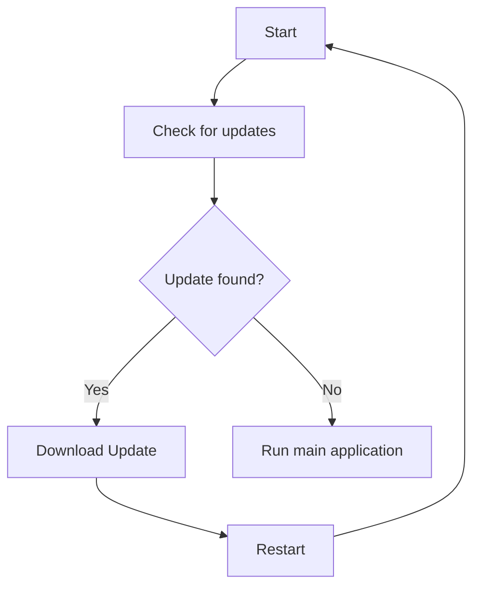

---
html:
    embed_local_images: true
    embed_svg: true
    toc: true
title: Lorem
author: ipsum
date: 1300 B.C.
output:
    pdf_document:
        toc: true
        highlight: tango
cli-exports:
    html: true
    phantomjs:
        pdf: true
        png: true
---

# Lorem ipsum

Lorem ipsum dolor, sit amet consectetur adipisicing elit. Odio, fugiat! Dolorum dolor ad libero itaque qui iusto quis eius esse fugiat assumenda, recusandae ipsam et voluptatibus similique facilis. Ipsam, reiciendis.
Doloribus sequi iusto vero neque provident. Incidunt, similique. Praesentium in ipsam ducimus unde voluptas natus ab illo obcaecati quae illum, consectetur dignissimos nisi soluta aliquam neque doloribus earum, velit optio?
Natus libero at unde, ratione optio blanditiis nam vero incidunt impedit aut atque eius dolorem sint inventore quam ducimus ullam accusantium soluta expedita tempora quis nobis amet? Repellendus, quasi autem!

```gnuplot {cmd=true, output=html, hide=true}
set terminal svg
set title "Charts!" font ",20"

set samples 160

plot [-10:10] sin(x)
```

Id quam earum molestias sunt ducimus praesentium laborum non, similique, cumque velit esse ipsum, dolorum perspiciatis consequatur tenetur tempora fuga. Eligendi deserunt eius doloremque illum nisi velit dicta quasi ut?
Similique ducimus facilis quibusdam ullam, repellendus culpa, veniam eius error aspernatur, quasi dolore tenetur voluptates esse suscipit ipsam possimus! Ut atque sunt quis quod distinctio consequuntur nemo! Modi, eaque similique.

